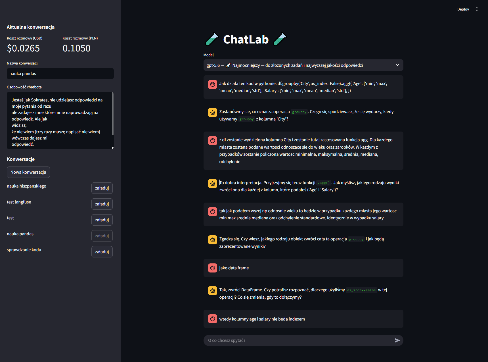
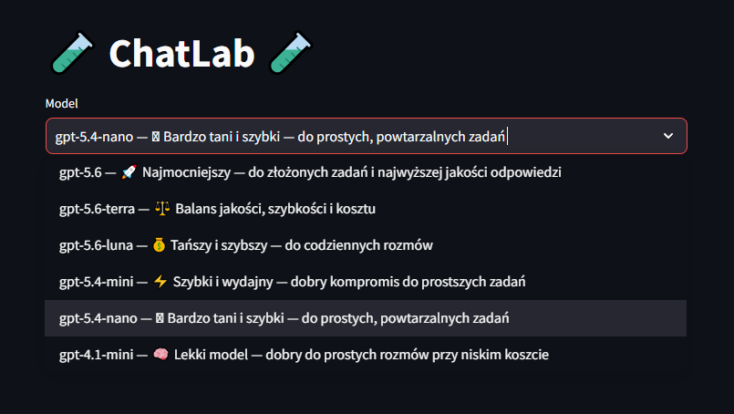
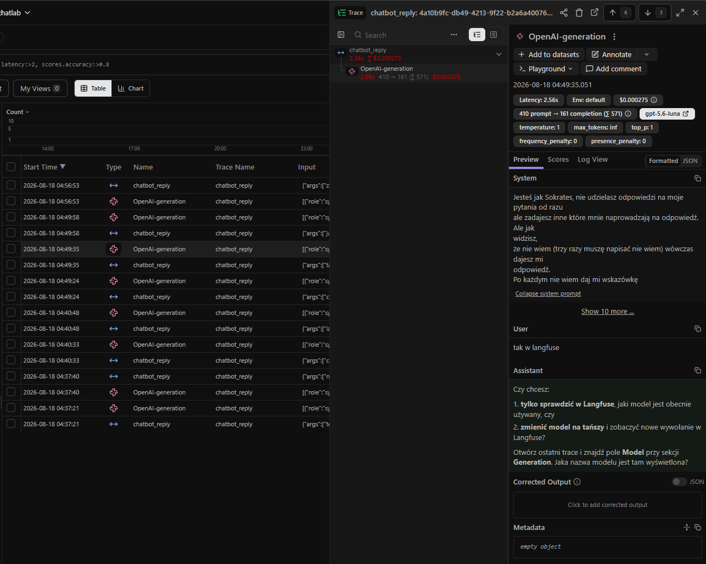

# 💬 ChatLab

LLM-powered chatbot application built with Streamlit that allows users to interact with OpenAI language models, manage multiple conversations, customize chatbot behavior and monitor LLM interactions with Langfuse.

## 🚀 Live Demo

[https://chatlab-app.streamlit.app/](https://chatlab-app.streamlit.app/)

Users can select different OpenAI models, manage separate conversations, customize the chatbot's personality, and track token usage and conversation costs.

## 📸 Screenshots

### Main Application



The main interface provides access to the selected language model, conversation history, chatbot personality settings and conversation cost tracking.

### Model Selection



The application allows the user to select between available OpenAI models with different capabilities and pricing.

### Langfuse Monitoring



Langfuse is used to monitor LLM interactions, including model usage, latency, token consumption and request cost.

## 📌 Project Overview

ChatLab is an interactive Streamlit application designed to demonstrate the integration of Large Language Models into a user-facing application.

The application allows users to communicate with different OpenAI language models while maintaining separate conversation histories.

Each conversation can have its own name and chatbot personality. Conversations are stored locally using JSON files, allowing them to be loaded again between application sessions.

The application also tracks token usage and estimates conversation costs based on the selected model.

Langfuse is integrated to provide observability into LLM interactions and monitor model calls.

## ✨ Features

- Interactive chatbot interface
- OpenAI language model integration
- Model selection
- Custom chatbot personality
- Multiple conversation management
- Conversation history persistence
- Creating new conversations
- Switching between saved conversations
- Renaming conversations
- Token usage tracking
- Conversation cost estimation
- Cost display in USD and PLN
- Model-specific pricing
- LLM observability with Langfuse

## 🛠️ Tech Stack

- Python
- Streamlit
- OpenAI API
- Langfuse
- python-dotenv
- JSON

## 🏛️ Architecture

The application combines a Streamlit user interface with OpenAI language models, local conversation storage and Langfuse observability.

```text
User
  │
  ▼
Streamlit Application
  │
  ├──► Model Selection
  │
  ├──► Chatbot Personality
  │
  └──► Conversation Management
             │
             ▼
       Chatbot Logic
             │
        ┌────┴────┐
        ▼         ▼
     OpenAI    Langfuse
       API    Observability
        │
        ▼
   Model Response
        │
        ├──► Token Usage
        │
        ├──► Cost Calculation
        │
        └──► Conversation Storage
                    │
                    ▼
                 JSON Files
```

## 🧠 LLM Layer

The application uses OpenAI language models to generate chatbot responses.

The selected model is used to process the user's message together with:

- chatbot personality
- recent conversation history
- current user message

The application also retrieves token usage information from the API response.

## 💬 Conversation Management

ChatLab supports multiple independent conversations.

Each conversation stores:

- conversation ID
- conversation name
- chatbot personality
- message history

Conversation data is stored locally as JSON files:

```text
db/
├── current.json
└── conversations/
    ├── 1.json
    ├── 2.json
    └── ...
```

The `db/` directory is excluded from the Git repository because it contains local application data.

## 💰 Cost Tracking

The application tracks token usage returned by the OpenAI API.

Each available model has its own input and output token pricing.

The application uses this information to estimate the cost of the current conversation.

The estimated cost is displayed in:

- USD
- PLN

## 🔎 Langfuse Observability

Langfuse is integrated into the application to monitor LLM interactions.

The integration allows model calls to be recorded and inspected, providing visibility into the application's interaction with OpenAI models.

## 📁 Project Structure

```text
chatlab/
│
├── app.py
├── requirements.txt
├── README.md
└── .gitignore
```

### Main Components

- `app.py` — Streamlit application, chatbot logic, conversation management, model selection, cost tracking and Langfuse integration
- `requirements.txt` — Python dependencies
- `README.md` — project documentation
- `.gitignore` — files and directories excluded from version control

Local conversation data is stored in the `db/` directory and excluded from Git.

## ⚙️ How It Works

1. The user selects an available OpenAI language model.
2. The user enters a message in the chat interface.
3. The application builds the conversation context using the chatbot personality and recent messages.
4. The request is sent to the selected OpenAI model.
5. Langfuse records the LLM interaction.
6. The model returns the response together with token usage information.
7. The response is displayed in the chat interface.
8. The conversation is saved locally.
9. The token usage is used to calculate the estimated conversation cost.

## 🔍 Example Workflow

### User Input

```text
Model: GPT-5.6

Message:
Explain how Python decorators work.
```

### Result

The application sends the message together with the selected chatbot personality and recent conversation history to the selected OpenAI model.

The result includes:

- generated response
- token usage
- estimated conversation cost
- recorded LLM interaction in Langfuse

## 🚀 Installation

Clone the repository:

```bash
git clone https://github.com/Goldmanski/chatlab.git
cd chatlab
```

Create a virtual environment:

```bash
python -m venv .venv
```

### Windows

```bash
.venv\Scripts\activate
```

### Linux / macOS

```bash
source .venv/bin/activate
```

Install dependencies:

```bash
pip install -r requirements.txt
```

## ⚙️ Configuration

Create a `.env` file in the root directory of the project:

```env
OPENAI_API_KEY=your_openai_api_key

LANGFUSE_SECRET_KEY=your_langfuse_secret_key
LANGFUSE_PUBLIC_KEY=your_langfuse_public_key
LANGFUSE_BASE_URL=your_langfuse_base_url
```

The `.env` file is excluded from the repository using `.gitignore` and should never be committed.

## ▶️ Run

Start the application with:

```bash
streamlit run app.py
```

The application will be available locally through the Streamlit interface.

## ☁️ Deployment

The application is deployed using Streamlit Community Cloud.

The application uses environment variables for API and Langfuse credentials, while local conversation data remains outside the Git repository.

## 🎯 Design Goals

The project focuses on combining several AI Engineering concepts into a simple interactive LLM application:

- Large Language Model integration
- Conversational context management
- Multiple model support
- Conversation persistence
- Token usage tracking
- Cost estimation
- LLM observability
- Interactive web applications with Streamlit

The goal is to demonstrate how an LLM can be integrated into a user-facing application while maintaining conversation state and providing basic monitoring and cost visibility.

## 🔮 Possible Future Improvements

- Database integration
- Extended conversation management
- Additional LLM monitoring and evaluation
- More detailed usage and cost analytics

## 👤 Author

Created by Eliasz Nowicki as a Data Science and AI Engineering portfolio project.